# install graphics
pip3 install --user http://bit.ly/csc161graphics

# create points list
./drawpoints.py

# calculate cluster
./drawclusters.py points1.txt 50
./drawclusters.py points5.txt 150

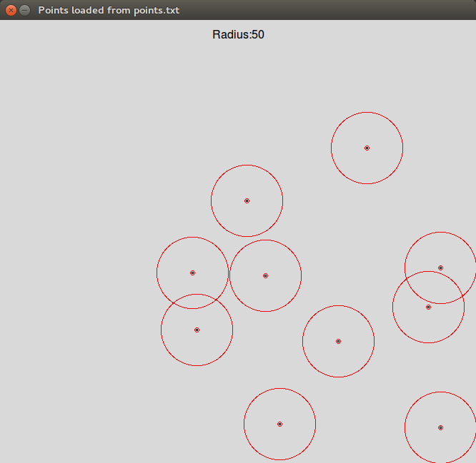
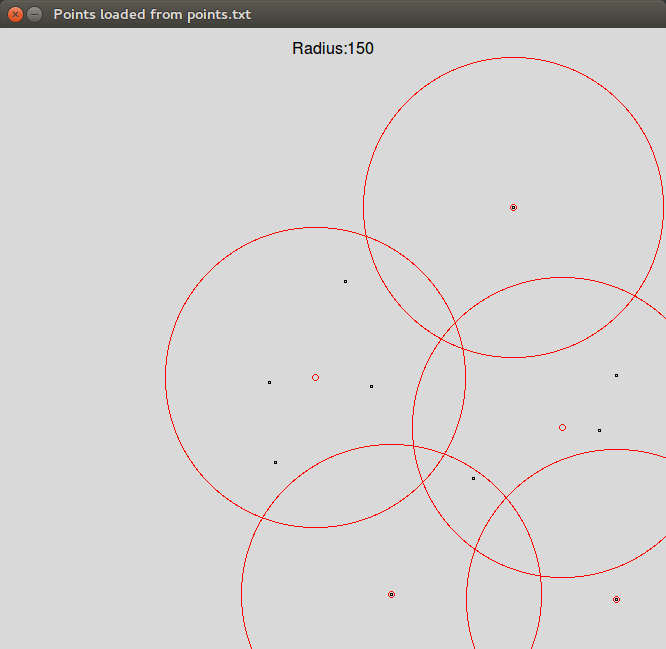
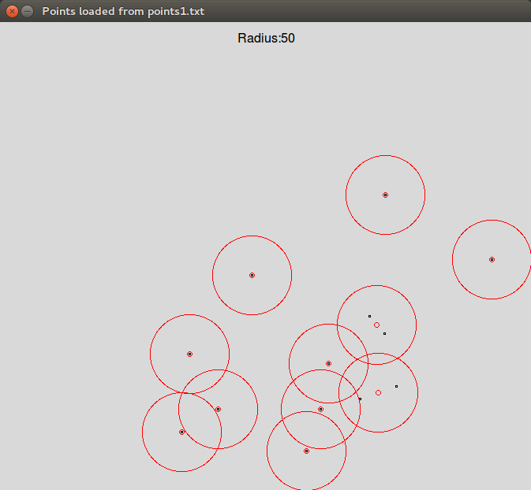
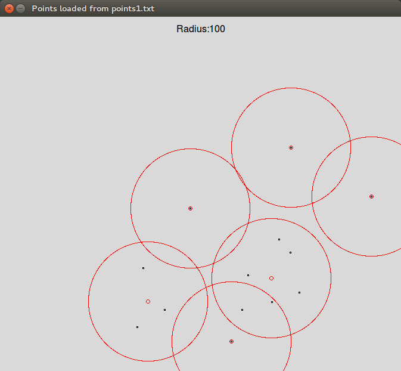
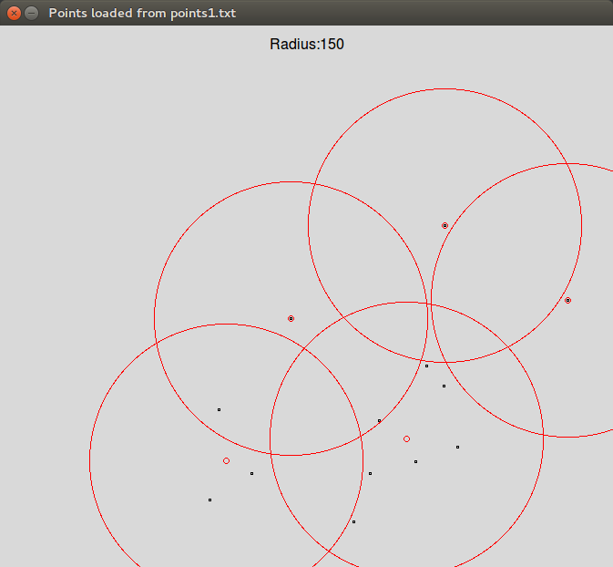
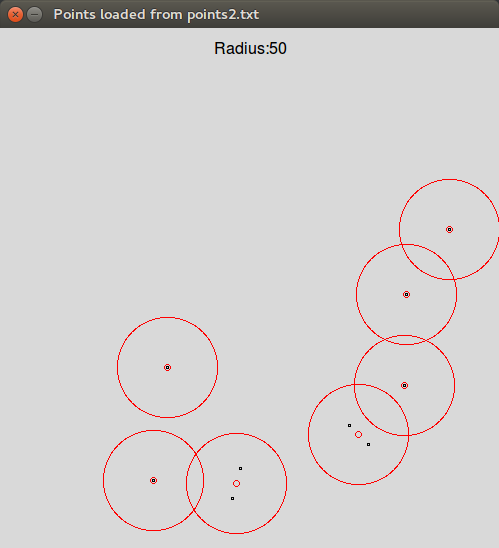
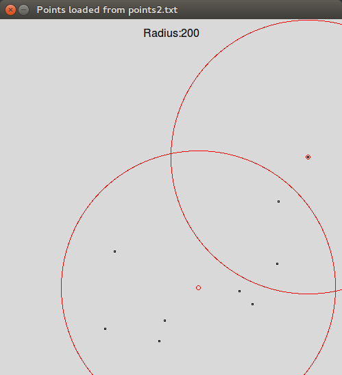
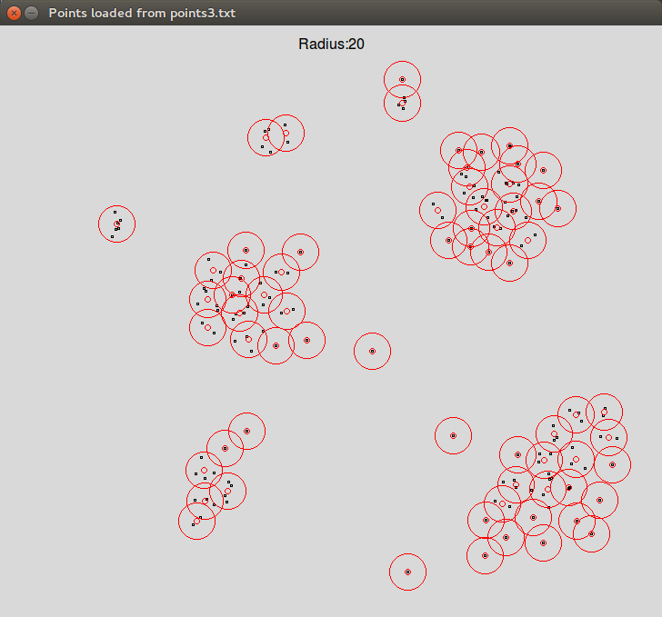
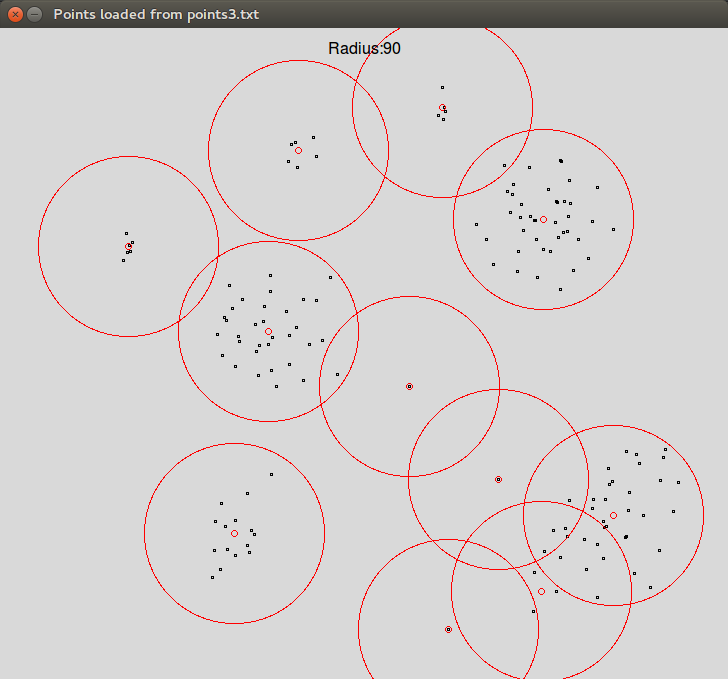

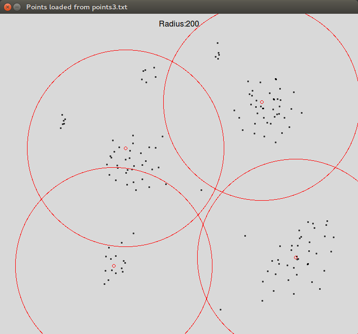
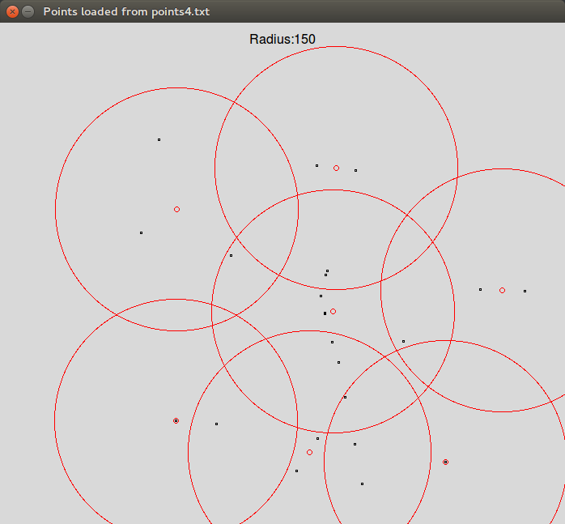
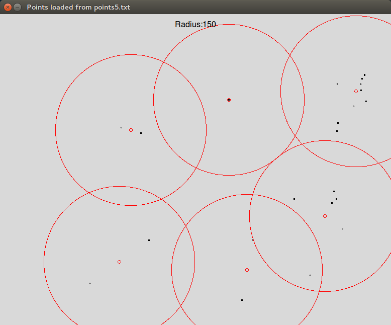
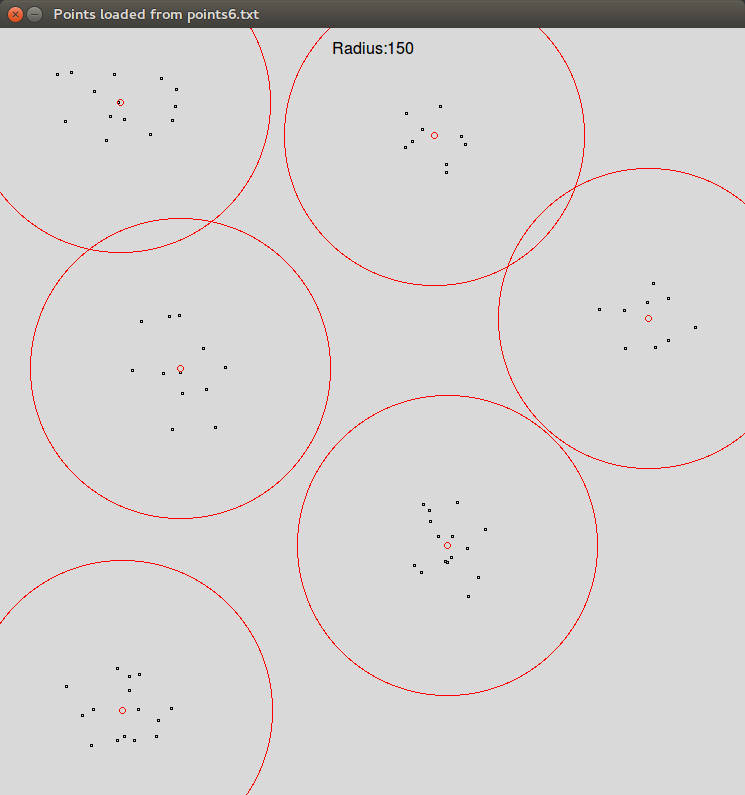

